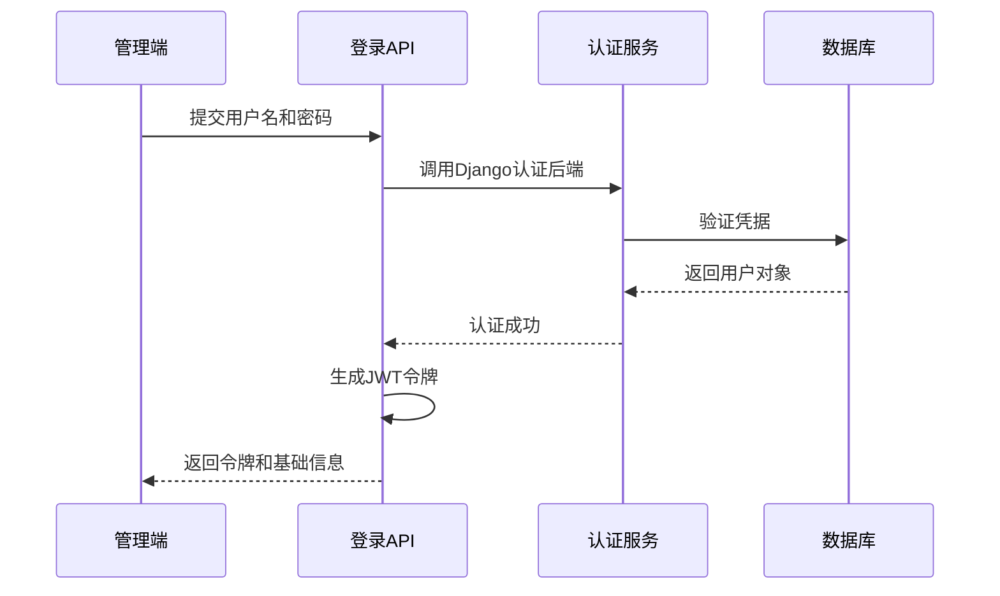
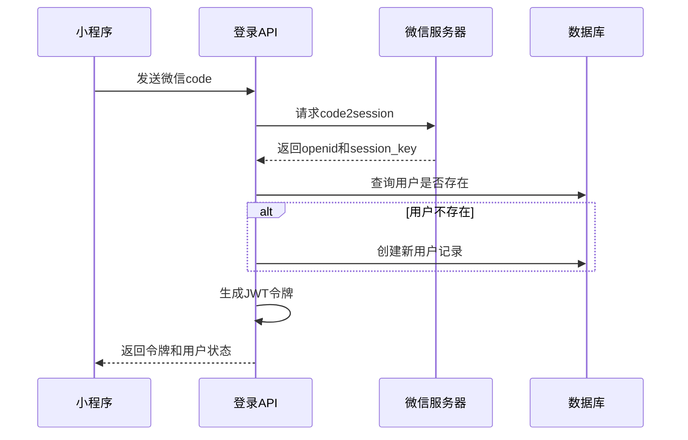
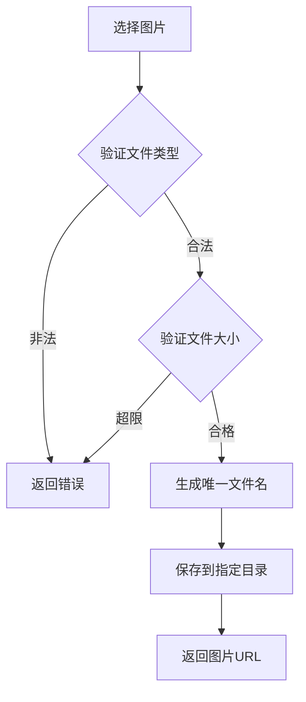
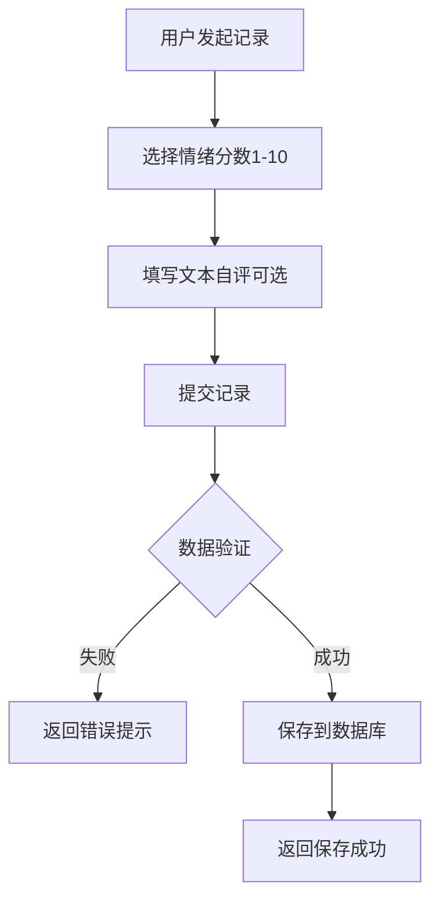
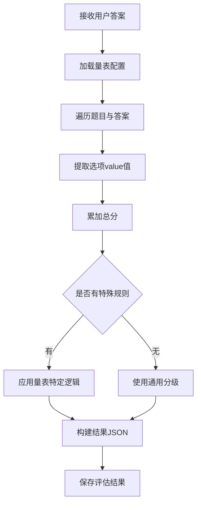
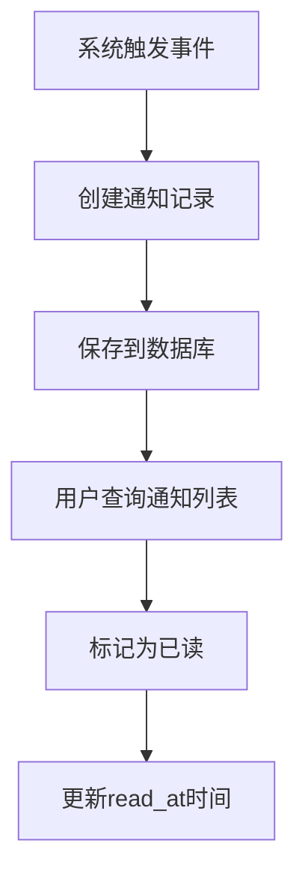

# 系统精简重构设计方案

## 一、设计目标

基于现有系统进行精简化重构，遵循快速实现、减法思维的原则，去除复杂功能，保留核心业务逻辑，确保系统稳定性与可维护性。

### 核心原则

- 精简优先：移除非必要功能，专注核心业务流程
- 快速实现：避免过度设计，采用最直接的实现方式
- 统一规范：统一响应格式、数据模型设计风格
- 基础功能：确保基本功能完整可用，暂缓扩展性考虑

## 二、用户认证模块重构

### 2.1 功能范围精简

**保留功能**
- 管理员账号密码登录
- 小程序用户微信授权登录
- 小程序内用户注册
- 基础用户信息管理

**移除功能**
- 用户头像上传功能
- 复杂的用户资料扩展字段
- 多登录方式切换
- 登录日志与审计

### 2.2 数据模型优化

#### User模型精简方案

**需要保留的字段**

| 字段分类 | 字段名称 | 说明 |
|---------|---------|------|
| 主键与标识 | id (UUID) | 用户唯一标识 |
| Django内置 | username, password | 管理员登录使用 |
| Django内置 | is_active, is_staff, is_superuser | 权限控制 |
| Django内置 | date_joined, last_login | 基础时间记录 |
| 微信授权 | wechat_openid | 小程序登录标识 |
| 微信授权 | wechat_unionid | 多应用统一用户（可选） |
| 角色字段 | role | 用户类型：user/admin |
| 基础资料 | nickname | 用户昵称 |
| 基础资料 | real_name | 真实姓名 |
| 基础资料 | gender | 性别 |
| 基础资料 | birthday | 生日 |
| 基础资料 | phone | 手机号 |
| 基础资料 | address | 地址 |
| 基础资料 | birthday | 生日 |

### 2.3 认证流程设计

#### 管理员登录流程



#### 小程序登录流程



#### 小程序内注册流程

注册即完善用户基础资料的过程：
- 首次登录后引导用户填写昵称、性别、生日
- 用户提交资料后更新数据库记录
- 更新完成后标记用户资料为已完善状态

### 2.4 API接口设计

#### 管理员登录接口

| 项目 | 内容 |
|------|------|
| 路径 | POST /api/auth/admin/login |
| 请求参数 | username (字符串), password (字符串) |
| 成功响应 | access_token, refresh_token, user 基础信息 |
| 失败响应 | 统一错误格式 |

#### 小程序登录接口

| 项目 | 内容 |
|------|------|
| 路径 | POST /api/auth/wechat/login |
| 请求参数 | code (微信授权码) |
| 成功响应 | access_token, refresh_token, is_new_user (布尔值), user 基础信息 |
| 失败响应 | 统一错误格式 |

#### 用户资料更新接口

| 项目 | 内容 |
|------|------|
| 路径 | PUT /api/users/profile |
| 请求头 | Authorization: Bearer {token} |
| 请求参数 | nickname, gender, birthday |
| 成功响应 | 更新后的用户信息 |
| 失败响应 | 统一错误格式 |

## 三、科普文章模块重构

### 3.1 功能范围精简

**保留功能**
- 文章列表查看
- 文章详情查看
- 文章发布/草稿状态管理
- 封面图片上传

**移除功能**
- 用户互动（点赞、评论、收藏）
- 文章分类与标签
- 文章搜索与筛选
- 阅读统计
- 相关文章推荐

### 3.2 数据模型优化

#### Article模型调整方案

**需要保留的字段**

| 字段名称 | 字段类型 | 说明 |
|---------|---------|------|
| id | 自增主键 | 文章ID |
| title | 字符串 | 文章标题 |
| content | 文本 | 文章内容 |
| cover_image | 文件字段 | 封面图片（改为上传） |
| status | 枚举 | draft/published |
| publish_time | 日期时间 | 发布时间 |
| created_at | 日期时间 | 创建时间 |
| updated_at | 日期时间 | 更新时间 |

**字段调整**
- cover_image：从CharField改为ImageField或FileField，支持图片上传

**需要移除的字段**
- author（作者关联）
- category（分类）
- tags（标签）
- view_count（浏览次数）
- like_count（点赞数）

### 3.3 图片上传处理

#### 上传方式设计

- 使用Django的媒体文件系统
- 图片保存路径：media/articles/covers/{year}/{month}/
- 文件命名：使用UUID避免冲突
- 支持的图片格式：jpg, jpeg, png
- 图片大小限制：最大2MB

#### 上传流程



### 3.4 API接口设计

#### 文章列表接口

| 项目 | 内容 |
|------|------|
| 路径 | GET /api/articles/ |
| 查询参数 | page (页码), page_size (每页数量) |
| 返回字段 | id, title, cover_image, publish_time |
| 排序规则 | 按发布时间倒序 |

#### 文章详情接口

| 项目 | 内容 |
|------|------|
| 路径 | GET /api/articles/{id} |
| 返回字段 | 完整文章信息 |

#### 图片上传接口

| 项目 | 内容 |
|------|------|
| 路径 | POST /api/articles/upload-cover |
| 请求方式 | multipart/form-data |
| 请求参数 | image (文件) |
| 成功响应 | image_url (图片访问地址) |

## 四、情绪日记模块重构

### 4.1 功能范围精简

**保留功能**
- 用户情绪打分记录
- 用户文本自评提交
- 日记历史记录查询

**移除功能**
- 情绪分析算法
- 情绪趋势图表
- 情绪预警功能
- AI智能分析
- 情绪统计报表

### 4.2 数据模型优化

#### MoodJournal模型精简方案

**需要保留的字段**

| 字段名称 | 字段类型 | 说明 |
|---------|---------|------|
| id | 自增主键 | 日记ID |
| user | 外键(User) | 关联用户 |
| mood_score | 小整数 | 情绪分数1-10 |
| text | 文本 | 用户自评内容 |
| record_date | 日期时间 | 记录日期 |
| created_at | 日期时间 | 创建时间 |
| updated_at | 日期时间 | 更新时间 |

**需要移除的字段**
- mood_name（情绪名称，简化流程）
- mood_emoji（情绪表情，简化流程）
- analysis_result（分析结果）
- tags（标签）

**字段调整说明**
- mood_score：保留基础打分功能，范围1-10
- text：允许用户自由输入情绪描述，字段长度保持适中（最大1000字符）

### 4.3 记录提交流程



### 4.4 API接口设计

#### 创建日记接口

| 项目 | 内容 |
|------|------|
| 路径 | POST /api/journals/ |
| 请求头 | Authorization: Bearer {token} |
| 请求参数 | mood_score (1-10整数), text (字符串, 可选), record_date (日期时间, 可选) |
| 成功响应 | 完整日记记录 |

#### 查询日记列表接口

| 项目 | 内容 |
|------|------|
| 路径 | GET /api/journals/ |
| 请求头 | Authorization: Bearer {token} |
| 查询参数 | page, page_size, start_date (可选), end_date (可选) |
| 返回数据 | 当前用户的日记列表，按时间倒序 |

#### 日记详情接口

| 项目 | 内容 |
|------|------|
| 路径 | GET /api/journals/{id} |
| 请求头 | Authorization: Bearer {token} |
| 返回数据 | 完整日记信息 |
| 权限控制 | 仅允许查看自己的日记 |

## 五、健康报告模块

### 5.1 保持现状

健康报告功能暂不修改，保持当前实现。

**现有模型保留**
- HealthReport模型所有字段保持不变
- 关联关系保持不变
- API接口保持不变

## 六、量表评估模块重构

### 6.1 功能范围精简

**保留功能**
- 量表配置管理（YAML加载）
- 用户答题提交
- 评分计算与结果生成
- 基础有效性检测

**移除功能**
- 题目跳转逻辑
- 量表推荐系统
- 评估中断与恢复
- 复杂的统计分析
- 评估对比功能

### 6.2 数据模型优化

#### ScaleConfig模型调整

保持现有结构，无需修改。

#### ScaleResult模型调整

保持现有结构，确保字段使用一致性。

### 6.3 评分算法重构

#### 核心需求

实现对所有YAML配置量表的统一评分处理，支持多种value值类型：
- 整数value（如PHQ-9: 0/1/2/3）
- 浮点value（预留支持）
- 不同量表的value范围差异处理

#### 统一评分流程设计



#### 评分算法设计

**通用评分逻辑**

| 步骤 | 说明 |
|------|------|
| 1. 数据准备 | 获取量表questions和用户selected_options |
| 2. 分数计算 | 遍历用户选择，从对应选项中提取value并累加 |
| 3. 分级判断 | 根据总分计算百分比，按阈值划分风险等级 |
| 4. 结果构建 | 生成包含总分、等级、建议的JSON对象 |

**量表类型映射表**

| 量表代码 | 量表类型 | value范围 | 评分方式 |
|---------|---------|----------|---------|
| PHQ-9 | PHQ | 0-3 | 累加总分，0-27分 |
| GAD-7 | GAD | 0-3 | 累加总分，0-21分 |
| ADL | ADL | 1-4 | 累加总分，20-80分 |
| Emotiontest | Emotion | 不固定 | 累加总分 |
| SCD-Q9 | SCD | 不固定 | 累加总分 |
| Alzheimers | Alzheimers | 不固定 | 累加总分 |
| SUS | SUS | 不固定 | 累加总分 |

**通用分级规则**

采用百分比分级法（适用于无特殊规则的量表）：

| 分数比例 | 风险等级 | 建议类型 |
|---------|---------|---------|
| < 25% | 低风险 | 继续保持 |
| 25%-50% | 轻度风险 | 关注观察 |
| 50%-75% | 中度风险 | 建议咨询 |
| ≥ 75% | 高风险 | 寻求专业帮助 |

#### 结果JSON结构设计

```
{
  "total_score": 整数,
  "max_score": 整数,
  "risk_level": "低风险" | "轻度风险" | "中度风险" | "高风险",
  "percentage": 浮点数,
  "recommendations": [
    "建议文本1",
    "建议文本2"
  ],
  "interpretation": "结果解释文本"
}
```

### 6.4 有效性检测设计

#### 检测规则（最简实现）

| 检测项 | 规则 | 判定 |
|-------|------|------|
| 答题完整性 | 用户选择数 = 题目数 | 否则无效 |
| 答题时长 | 完成时间 - 开始时间 > 最小时长（如10秒） | 过快则可疑 |
| 选项有效性 | 每个选择的索引在有效范围内 | 否则无效 |

#### 无效标记处理

- 暂不强制拒绝，仅在结果中添加警告标识
- 保存结果时记录警告信息到analysis字段

### 6.5 API接口设计

#### 获取量表配置接口

| 项目 | 内容 |
|------|------|
| 路径 | GET /api/scales/{code} |
| 路径参数 | code (量表代码) |
| 返回数据 | 完整量表配置（name, description, questions等） |

#### 提交评估接口

| 项目 | 内容 |
|------|------|
| 路径 | POST /api/scales/{code}/submit |
| 请求头 | Authorization: Bearer {token} |
| 请求参数 | selected_options (数组), started_at (ISO时间), completed_at (ISO时间) |
| 成功响应 | 评估结果ID和完整analysis结果 |

#### 查询评估结果接口

| 项目 | 内容 |
|------|------|
| 路径 | GET /api/scales/results/{id} |
| 请求头 | Authorization: Bearer {token} |
| 返回数据 | 完整评估结果记录 |
| 权限控制 | 仅允许查看自己的结果 |

## 七、通知系统设计

### 7.1 功能需求

**核心功能**
- 系统消息推送
- 消息列表查看
- 消息已读/未读标记
- 消息删除

**暂不实现**
- 实时推送（WebSocket）
- 消息分类与筛选
- 批量操作
- 消息模板管理

### 7.2 数据模型设计

#### Notification模型

| 字段名称 | 字段类型 | 说明 |
|---------|---------|------|
| id | 自增主键 | 通知ID |
| user | 外键(User) | 接收用户 |
| title | 字符串 | 通知标题 |
| content | 文本 | 通知内容 |
| notification_type | 枚举 | 通知类型：system/assessment/reminder |
| is_read | 布尔 | 是否已读，默认False |
| related_id | 整数(可选) | 关联对象ID |
| related_type | 字符串(可选) | 关联对象类型 |
| created_at | 日期时间 | 创建时间 |
| read_at | 日期时间(可选) | 阅读时间 |

#### 索引设计

- user + is_read：加速未读消息查询
- user + created_at：加速消息列表排序

### 7.3 通知类型说明

| 类型代码 | 类型名称 | 使用场景 |
|---------|---------|---------|
| system | 系统通知 | 系统公告、更新提醒 |
| assessment | 评估通知 | 评估完成、结果生成 |
| reminder | 提醒通知 | 定期评估提醒 |

### 7.4 消息流转流程



### 7.5 API接口设计

#### 获取通知列表接口

| 项目 | 内容 |
|------|------|
| 路径 | GET /api/notifications/ |
| 请求头 | Authorization: Bearer {token} |
| 查询参数 | page, page_size, is_read (可选布尔) |
| 返回数据 | 通知列表，按创建时间倒序 |

#### 标记已读接口

| 项目 | 内容 |
|------|------|
| 路径 | PUT /api/notifications/{id}/read |
| 请求头 | Authorization: Bearer {token} |
| 成功响应 | 更新后的通知记录 |

#### 删除通知接口

| 项目 | 内容 |
|------|------|
| 路径 | DELETE /api/notifications/{id} |
| 请求头 | Authorization: Bearer {token} |
| 成功响应 | 删除确认 |

#### 获取未读数量接口

| 项目 | 内容 |
|------|------|
| 路径 | GET /api/notifications/unread-count |
| 请求头 | Authorization: Bearer {token} |
| 返回数据 | { "count": 整数 } |

## 八、统一响应格式设计

### 8.1 Django-Ninja推荐格式

遵循Django-Ninja的Schema设计模式，使用Pydantic进行数据验证和序列化。

### 8.2 标准响应结构

#### 成功响应格式

```
{
  "code": 200,
  "message": "操作成功",
  "data": {
    // 实际业务数据
  }
}
```

#### 分页响应格式

```
{
  "code": 200,
  "message": "查询成功",
  "data": {
    "items": [
      // 数据列表
    ],
    "total": 总记录数,
    "page": 当前页码,
    "page_size": 每页数量,
    "total_pages": 总页数
  }
}
```

#### 错误响应格式

```
{
  "code": 错误码,
  "message": "错误描述",
  "errors": {
    // 详细错误信息（可选）
    "field_name": ["错误原因"]
  }
}
```

### 8.3 HTTP状态码使用规范

| HTTP状态码 | 业务code | 使用场景 |
|-----------|---------|---------|
| 200 | 200 | 请求成功 |
| 201 | 201 | 创建成功 |
| 400 | 400 | 请求参数错误 |
| 401 | 401 | 未认证 |
| 403 | 403 | 无权限 |
| 404 | 404 | 资源不存在 |
| 500 | 500 | 服务器错误 |

### 8.4 Schema设计示例结构

使用Pydantic Schema定义输入输出模型：

**通用响应Schema**
- BaseResponse：包含code、message、data的基础结构
- PaginatedResponse：继承BaseResponse，添加分页信息
- ErrorResponse：包含code、message、errors的错误结构

**业务Schema**
- 输入Schema：用于接收和验证请求参数
- 输出Schema：用于序列化返回数据
- Schema与数据模型分离，仅暴露必要字段

## 九、数据模型统一规范

### 9.1 模型设计原则

- 字段精简：移除非核心字段，避免冗余
- 命名一致：统一字段命名风格（使用下划线命名）
- 类型统一：相同语义字段使用相同数据类型
- 时间戳统一：所有模型包含created_at和updated_at
- 主键统一：根据业务特点选择合适主键类型

### 9.2 主键类型规范

| 模型 | 主键类型 | 理由 |
|------|---------|------|
| User | UUID | 安全性高，防止枚举攻击 |
| Article | 自增ID | 简单场景，性能优先 |
| MoodJournal | 自增ID | 简单场景，性能优先 |
| ScaleConfig | 自增ID | 配置数据，数量有限 |
| ScaleResult | 自增ID | 简单场景，性能优先 |
| HealthReport | 自增ID | 简单场景，性能优先 |
| Notification | 自增ID | 简单场景，性能优先 |

### 9.3 外键关联规范

**关联字段命名**
- 关联User模型统一使用：user (ForeignKey)
- 避免使用user_id (UUIDField)与user (ForeignKey)混用

**级联删除策略**

| 模型 | 关联User的行为 | 理由 |
|------|---------------|------|
| MoodJournal | CASCADE | 用户删除后日记无意义 |
| ScaleResult | CASCADE | 用户删除后结果无意义 |
| HealthReport | CASCADE | 用户删除后报告无意义 |
| Notification | CASCADE | 用户删除后通知无意义 |

### 9.4 时间字段统一

所有模型必须包含：
- created_at：创建时间，auto_now_add=True
- updated_at：更新时间，auto_now=True

特殊业务时间字段单独定义（如publish_time, record_date）。

### 9.5 枚举字段规范

使用CharField + choices方式定义枚举：

**统一choices格式**
```
CHOICES = [
    ('value', '显示名称'),
    ...
]
```

**常见枚举字段**
- status：状态字段，如draft/published, active/inactive
- role：角色字段，如user/admin
- type：类型字段，根据业务定义

### 9.6 模型Meta配置规范

每个模型需要配置：
- verbose_name：中文模型名（单数）
- verbose_name_plural：中文模型名（复数）
- ordering：默认排序规则（通常按时间倒序）
- indexes：关键查询字段添加索引

## 十、实施优先级

### 10.1 第一阶段：核心认证与基础模型

**任务清单**
1. 精简User模型，移除非必要字段
2. 调整所有模型的关联关系，确保外键统一
3. 实现统一响应格式的基础Schema
4. 完成管理员登录功能
5. 完成小程序登录与注册功能

**验收标准**
- 管理员可正常登录并获取JWT令牌
- 小程序用户可通过微信授权登录
- 新用户可完善基础资料
- API响应符合统一格式规范

### 10.2 第二阶段：业务模块精简

**任务清单**
1. 重构Article模型，实现封面图片上传
2. 精简MoodJournal模型，移除复杂字段
3. 创建Notification模型
4. 调整各模型的Meta配置和索引

**验收标准**
- 文章管理功能正常，支持图片上传
- 情绪日记可正常提交和查询
- 通知系统模型就绪

### 10.3 第三阶段：量表评估优化

**任务清单**
1. 重构评分算法，支持所有YAML量表
2. 实现统一的结果JSON生成
3. 实现基础有效性检测
4. 完善量表相关API接口

**验收标准**
- 所有YAML配置的量表均可正确评分
- 评估结果包含完整的analysis JSON
- 有效性检测正常工作
- API返回格式统一

### 10.4 第四阶段：通知与完善

**任务清单**
1. 实现通知系统API
2. 完善所有模块的API文档
3. 统一错误处理和响应格式
4. 基础功能测试

**验收标准**
- 通知系统功能完整可用
- 所有API响应格式统一
- 基础流程可正常运行

## 十一、技术实现要点

### 11.1 图片上传处理

**Django配置**
- 配置MEDIA_ROOT和MEDIA_URL
- 使用FileSystemStorage存储
- 开发环境通过Django提供静态文件服务

**字段定义**
- 使用ImageField，设置upload_to参数
- 设置max_length适应完整路径

**验证处理**
- 文件类型验证：限制为图片格式
- 文件大小验证：使用自定义验证器

### 11.2 JWT认证集成

**令牌生成**
- 使用ninja-jwt库
- 自定义claim添加用户角色等信息

**令牌验证**
- 使用Django-Ninja的认证装饰器
- 从请求头获取并验证令牌

**令牌刷新**
- 提供refresh接口
- 验证refresh_token有效性后颁发新access_token

### 11.3 微信登录实现

**code2session调用**
- 使用requests库请求微信API
- 处理网络异常和API错误
- 缓存session_key（如使用cache框架）

**用户创建逻辑**
- 检查openid是否存在
- 不存在则创建新User，设置wechat_openid
- 创建时不设置password（使用set_unusable_password）

### 11.4 评分算法实现

**函数设计**
- 输入：ScaleConfig对象，用户selected_options列表
- 输出：包含总分、等级、建议的字典

**处理逻辑**
- 遍历questions，通过索引获取对应用户选择
- 从选项中提取value并累加
- 根据量表类型或通用规则计算等级
- 构建结果JSON

**异常处理**
- 索引越界时跳过或记录为无效
- value不存在时默认为0

### 11.5 统一响应封装

**实现方式**
- 定义通用Schema：SuccessResponse, ErrorResponse
- 在视图函数中返回Schema实例
- Django-Ninja自动序列化为JSON

**示例结构**
```
class SuccessResponse(Schema):
    code: int = 200
    message: str
    data: Any

class ErrorResponse(Schema):
    code: int
    message: str
    errors: dict = None
```

## 十二、注意事项

### 12.1 数据库迁移

- 字段删除前备份数据库
- 生成迁移文件时检查依赖关系
- 分阶段执行迁移，避免一次性大改
- 保留旧字段一段时间再删除（软删除策略）

### 12.2 向后兼容

- API路径保持稳定，避免频繁变更
- 移除功能时保留接口返回空数据或提示
- 前端调用的字段暂时保留，逐步废弃

### 12.3 安全性

虽然不特别强化，但基础安全措施必须保留：
- JWT令牌验证
- 用户权限检查（仅能访问自己的数据）
- SQL注入防护（Django ORM自带）
- XSS防护（模板自动转义）

### 12.4 性能考虑

- 高频查询字段添加索引
- 避免N+1查询，使用select_related/prefetch_related
- 分页查询避免加载全部数据

### 12.5 代码规范

- 遵循PEP 8规范
- 函数和类添加docstring
- 复杂逻辑添加注释
- 保持代码简洁，避免过度封装
